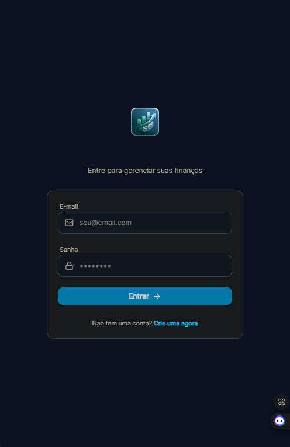
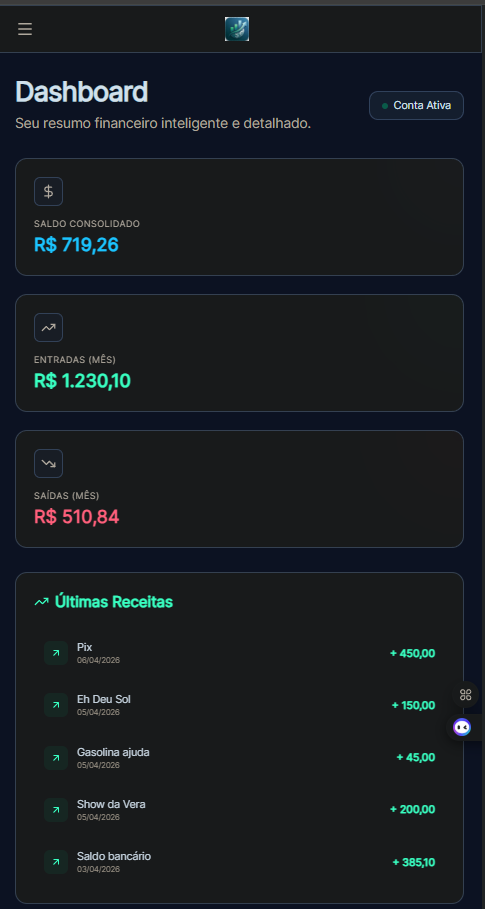
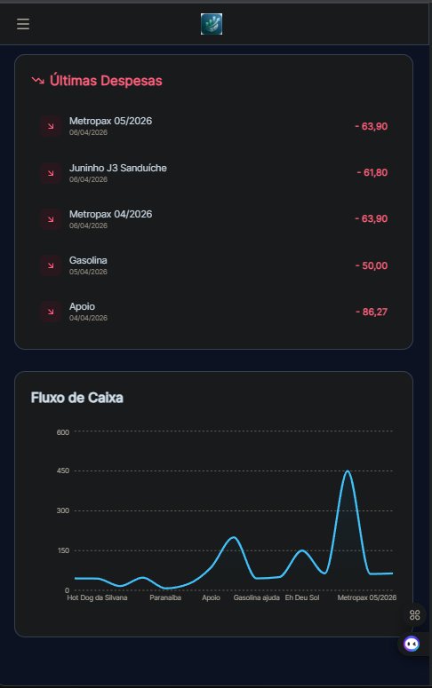
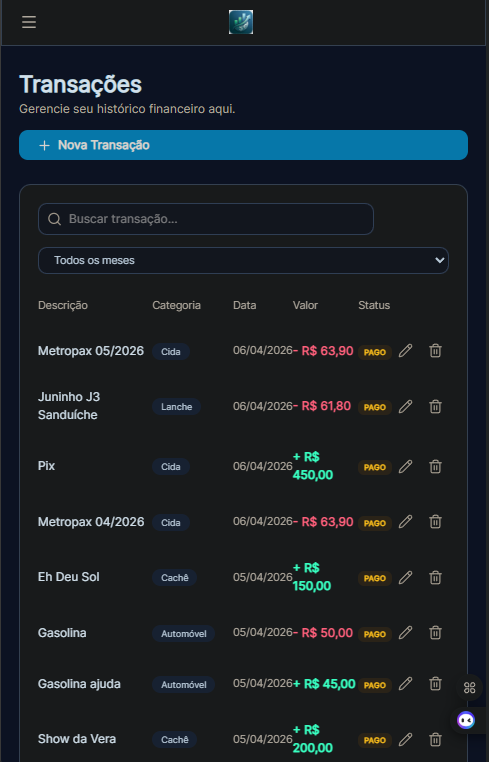
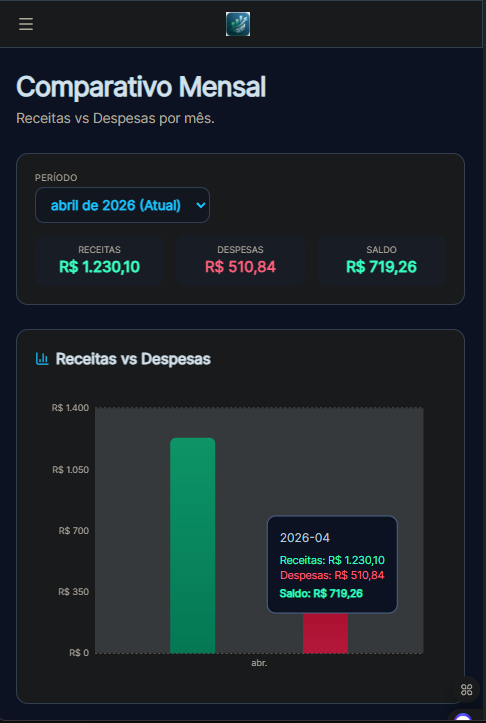
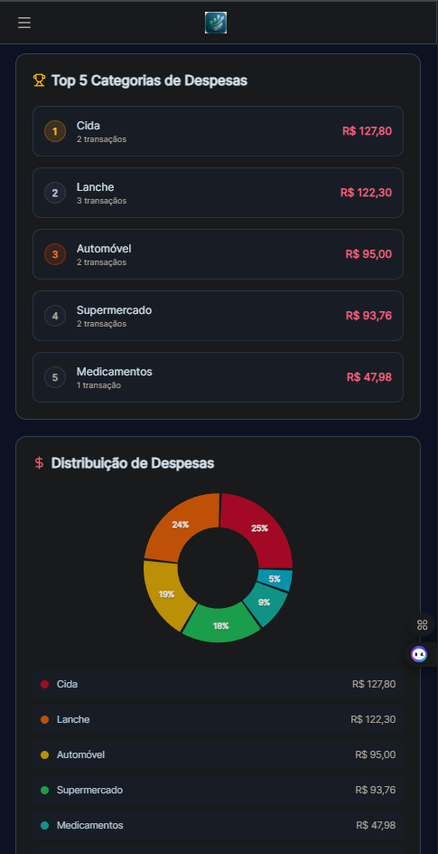
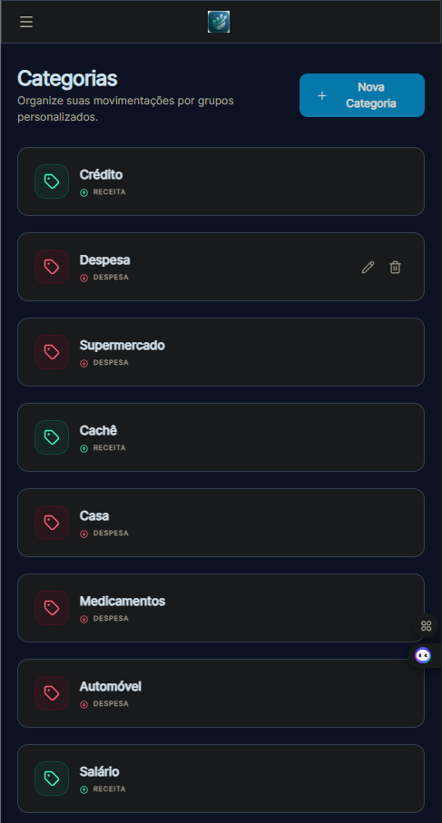
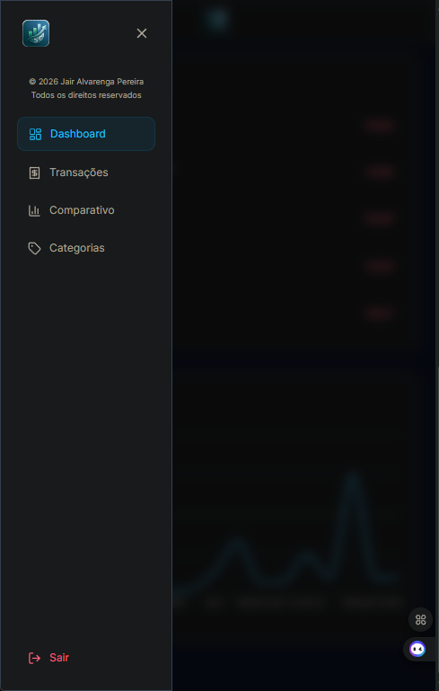

# Gestão Financeira - Frontend

<div align="center">


Uma aplicação web moderna para gerenciamento de finanças pessoais, desenvolvida com React, TypeScript e Tailwind CSS.


</div>

---

## 📋 Sobre o Projeto

O **Gestão Financeira** é uma aplicação completa para controle de receitas e despesas pessoais. Com uma interface intuitiva e visual moderna, você pode acompanhar sua situação financeira, categorizar transações e visualizar relatórios gráficos do seu fluxo de caixa.

---

## 🖼️ Screenshots

### 🔐 Login


### 📊 Dashboard
  


### 💰 Transações


### 📈 Comparativo Mensal
  


### 📁 Categorias


### 📱 Menu


---

## 🚀 Funcionalidades

### 🔐 Autenticação
- Login e registro de usuários
- Tokens JWT para autenticação segura
- Persistência de sessão
- Interface personalizada com logo

### 💰 Transações
- Criação, edição e exclusão de transações
- Categorização de receitas e despesas
- Status de pagamento (pago/pendente)
- Filtro por período (mensal)
- Busca por descrição ou categoria

### 📊 Dashboard
- Saldo consolidado em tempo real
- Entradas e saídas do mês atual
- Lista das últimas receitas e despesas
- Gráfico de fluxo de caixa (área)

### 📈 Comparativo Mensal
- Gráfico de barras comparando receitas vs despesas
- Ranking das top 5 categorias de despesas
- Gráfico de pizza com distribuição de despesas por categoria
- Filtro por período (todos os meses ou mensal)

### 📁 Categorias
- Criação e gerenciamento de categorias
- Ícones para identificação visual
- Categorias para receitas e despesas

---

## 🛠️ Tecnologias Utilizadas

| Tecnologia | Descrição |
|------------|------------|
| **React 19** | Biblioteca principal para interface de usuário |
| **TypeScript** | Tipagem estática para código mais seguro |
| **Vite** | Build tool rápido e moderno |
| **Tailwind CSS** | Framework CSS utilitário |
| **Recharts** | Biblioteca de gráficos |
| **React Router** | Roteamento de páginas |
| **TanStack Query** | Gerenciamento de estado e caching |
| **Axios** | Cliente HTTP para API |
| **Lucide React** | Biblioteca de ícones |
| **Framer Motion** | Animações suaves |

---

## 📁 Estrutura do Projeto

```
src/
├── assets/                # Imagens e recursos estáticos
│   ├── Logo.png          # Logo da aplicação
│   └── Screenshot_*.png  # Screenshots para documentação
├── components/           # Componentes reutilizáveis
│   ├── CategoryModal.tsx
│   ├── Sidebar.tsx
│   └── TransactionModal.tsx
├── pages/               # Páginas da aplicação
│   ├── Categories.tsx
│   ├── Comparison.tsx
│   ├── Dashboard.tsx
│   ├── Login.tsx
│   ├── Register.tsx
│   └── Transactions.tsx
├── services/            # Serviços e API
│   └── api.ts
├── App.tsx              # Componente principal
├── main.tsx            # Entry point
└── index.css           # Estilos globais
```

---

## 🎨 Design System

### Cores Padrão
- **Receitas**: Emerald (verde) - `#10b981`
- **Despesas**: Rose (vermelho) - `#f43f5e`
- **Saldo Positivo**: Sky (azul) - `#38bdf8`
- **Saldo Negativo**: Rose (vermelho) - `#f43f5e`

### Paleta de Cores do Gráfico de Pizza
```
#f43f5e (Rose)     #f97316 (Orange)   #eab308 (Yellow)
#22c55e (Green)    #14b8a6 (Teal)      #06b6d4 (Cyan)
#3b82f6 (Blue)    #6366f1 (Indigo)    #8b5cf6 (Violet)
#a855f7 (Purple)
```

---

## ▶️ Como Executar

### Pré-requisitos
- Node.js 18+ 
- NPM ou Yarn

### Instalação

```bash
# Clone o repositório
git clone https://github.com/jairalvarengapereira/GestaoFinanceira-Frontend.git

# Entre no diretório
cd GestaoFinanceira-Frontend

# Instale as dependências
npm install
```

### Configuração

Crie um arquivo `.env` na raiz do projeto:

```env
VITE_API_URL=http://localhost:3000
```

### Executando o Projeto

```bash
# Modo desenvolvimento
npm run dev

# Build para produção
npm run build

# Preview do build
npm run preview
```

---

## 📱 Responsividade

A aplicação é totalmente responsiva e funciona em:
- 📱 Mobile (< 640px)
- 📱 Tablet (640px - 1024px)
- 💻 Desktop (> 1024px)

---

## 🔄 Integração com API

Este frontend foi desenvolvido para integração com uma API REST. As principais funcionalidades esperadas da API:

- `GET /transactions` - Listar transações
- `POST /transactions` - Criar transação
- `PUT /transactions/:id` - Atualizar transação
- `DELETE /transactions/:id` - Excluir transação
- `GET /categories` - Listar categorias
- `POST /auth/login` - Login
- `POST /auth/register` - Registro

---

## 📝 Licença

Este projeto está sob a licença MIT.

---

## 👨‍💻 Autor

**Jair Alvarenga Pereira**

- GitHub: [@jairalvarengapereira](https://github.com/jairalvarengapereira)

---

<div align="center">

Made with ❤️ using React + TypeScript + Tailwind

</div>
