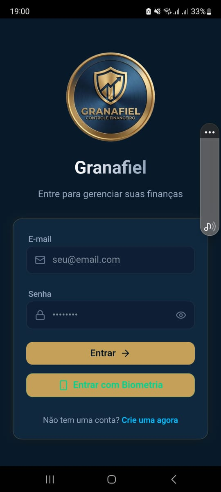
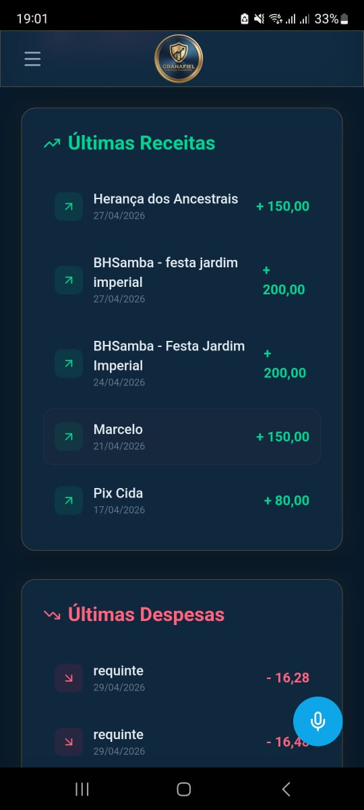
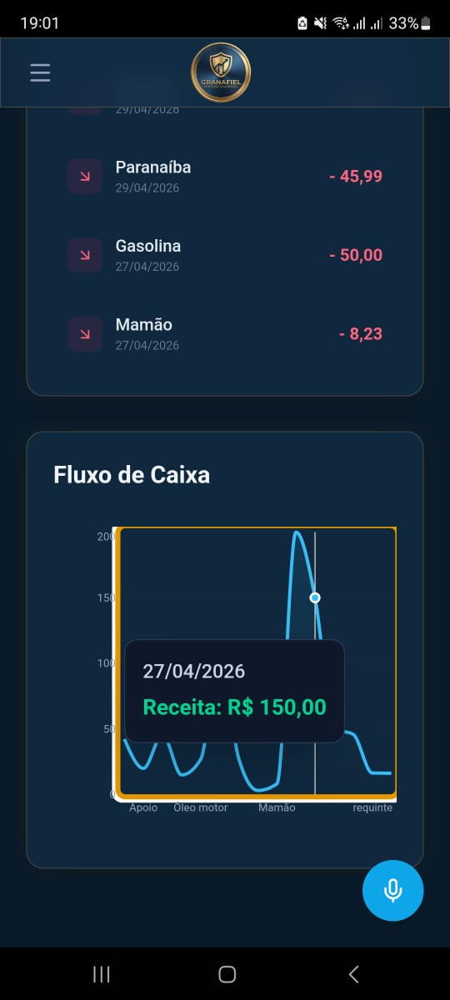
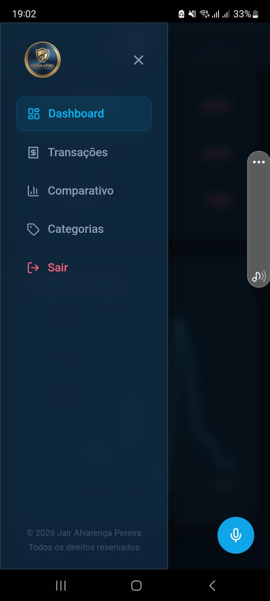
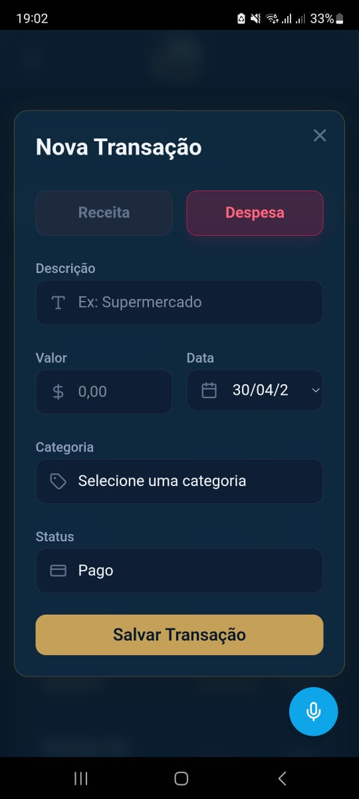
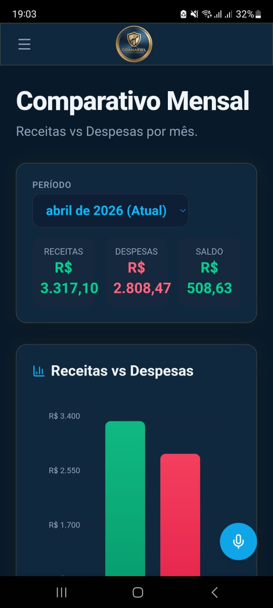
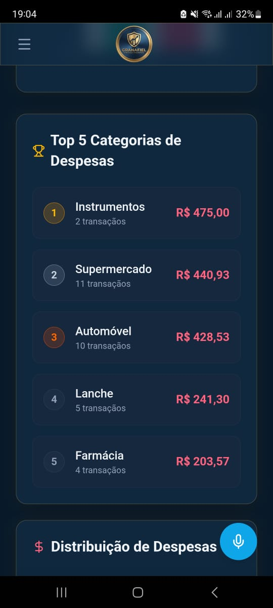
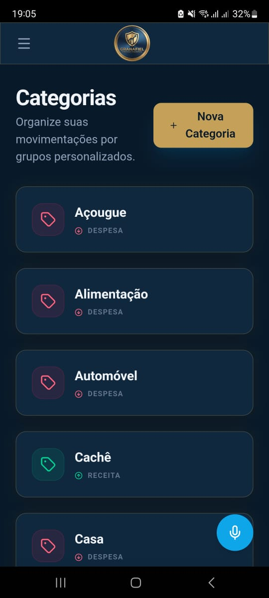

# Granafiel

## 🚀 Sistema de Gestão Financeira Pessoal

<div align="center">


Uma solução completa para controle financeiro pessoal com versão web e mobile. Gerencie suas finanças de forma simples, segura e moderna.

[**Acessar Web**](https://granafiel.netlify.app) &nbsp;|&nbsp; [**Baixar APK**](https://github.com/jairalvarengapereira/granafiel/raw/main/Granafiel.apk) &nbsp;|&nbsp; [**Manual do Usuário**](MANUAL.md)

</div>

---

## 🎯 Por que usar o Granafiel?

| Recurso | Descrição |
|---------|-----------|
| 💰 **Controle Total** | Acompanhe receitas e despesas em um só lugar |
| 📱 **Multiplataforma** | Acesse via web ou instale no celular |
| 🔐 **Segurança** | Autenticação biométrica (mobile) e tokens JWT |
| 🎤 **Entrada por Voz** | Grave suas transações falando (mobile) |
| 📊 **Gráficos Inteligentes** | Visualize seu fluxo de caixa |
| 🔄 **Sincronização** | Dados sempre atualizados |

---

## 📸 Screenshots

### 🖥️ Versão Web

| Login | Registro |
|-------|----------|
|  |  |

| Dashboard | Transações |
|-----------|------------|
|  |  |

| Adicionar Transação | Categorias |
|---------------------|-------------|
|  |  |

### 📱 Versão Mobile

| Comparativo | Entrada por Voz |
|--------------|----------------|
|  |  |

| Autenticação Biométrica | Gráficos |
|-------------------------|----------|
|  |  |

---

## ✨ Funcionalidades

### 🔐 Autenticação Segura
- Login e registro de usuários
- Tokens JWT para sessão segura
- **Biometria** (impressão digital / rosto) no mobile

### 💰 Gestão de Transações
- Criar, editar e excluir transações
- Categorização automática
- Status: Pago ou Pendente
- Filtro por período

### 📊 Dashboard Inteligente
- Saldo em tempo real
- Gráfico de fluxo de caixa
- Resumo do mês atual

### 📈 Relatórios e Comparativos
- Gráfico de barras (receitas vs despesas)
- Top 5 categorias de gastos
- Gráfico de pizza por categoria
- Comparativo entre meses

### 🎤 Entrada por Voz (Mobile)
- Grave transações falando
- O app entende valores e categorias
- Muito mais rápido e prático

---

## 🛠️ Tecnologias

| Categoria | Tecnologia |
|------------|------------|
| **Frontend** | React 19, TypeScript, Vite |
| **Estilização** | Tailwind CSS 4 |
| **Mobile** | Capacitor (Android) |
| **Gráficos** | Recharts |
| **Animações** | Framer Motion |
| **Ícones** | Lucide React |
| **API** | Axios, TanStack Query |
| **Auth** | JWT, Biometria (Capacitor) |
| **Voz** | Speech Recognition (Capacitor) |

---

## 📂 Estrutura do Projeto

```
/
├── public/
│   ├── images/           # Screenshots para docs
│   └── Logo.png         # Logo do app
├── src/
│   ├── pages/          # Páginas React
│   │   ├── Login.tsx
│   │   ├── Register.tsx
│   │   ├── Dashboard.tsx
│   │   ├── Transactions.tsx
│   │   ├── Categories.tsx
│   │   └── Comparison.tsx
│   ├── components/       # Componentes
│   │   ├── Sidebar.tsx
│   │   ├── VoiceFAB.tsx
│   │   ├── TransactionModal.tsx
│   │   └── CategoryModal.tsx
│   ├── services/        # Serviços
│   │   ├── api.ts
│   │   └── biometric.ts
│   └── assets/
│       └── Logo.png
├── Granafiel-Android/  # Projeto Android (Capacitor)
├── Granafiel-Backend/  # API Node.js
└── Granafiel.apk      # App Mobile
```

---

## 🚦 Começando

### 🌐 Versão Web

```bash
# Instalar dependências
npm install

# Executar em desenvolvimento
npm run dev

# Build para produção
npm run build
```

Acesse: **https://granafiel.netlify.app**

### 📱 Versão Mobile (Android)

1. Baixe a APK: [Granafiel.apk](https://github.com/jairalvarengapereira/granafiel/raw/main/Granafiel.apk)
2. Enable "Install unknown apps" nas configurações
3. Abra o arquivo e instale
4. Pronto! Use offline ou conecte à API

### ⚙️ Configuração

Crie `.env` na raiz:

```env
VITE_API_URL=https://sua-api-aqui.com
```

---

## 🔗 Links Úteis

| Recurso | Link |
|---------|------|
| 🌐 **Web App** | https://granafiel.netlify.app |
| 📱 **APK** | https://github.com/jairalvarengapereira/granafiel/raw/main/Granafiel.apk |
| 📖 **Manual** | https://github.com/jairalvarengapereira/granafiel/blob/main/MANUAL.md |
| 💻 **Código** | https://github.com/jairalvarengapereira/granafiel |

---

## 📝 Licença

MIT License - Jair Alvarenga Pereira

---

<div align="center">

Feito com ❤️ para ajudá-lo a controlar suas finanças


</div>
